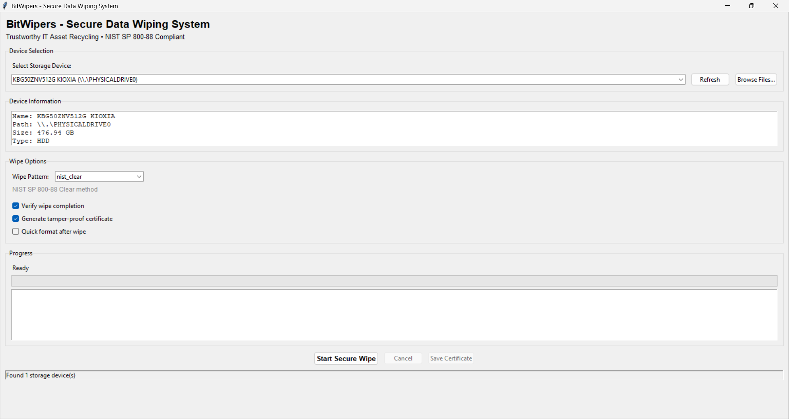
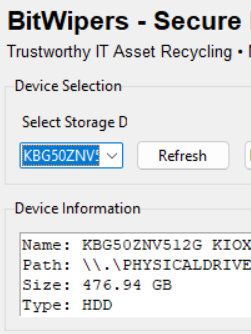
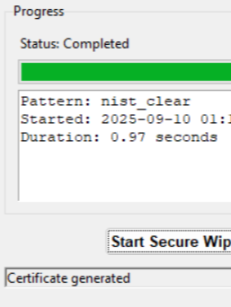
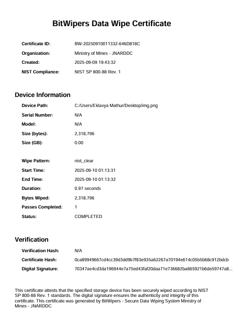

<div align="center">

# 🛡️ BitWipers

### **Secure Data Wiping for Trustworthy IT Asset Recycling**

[](https://www.python.org/downloads/)
[](LICENSE)
[]()
[]()

<p align="center">
  <strong>Addressing India's ₹50,000 Crore E-Waste Crisis with Secure Data Sanitization</strong>
</p>

[**🚀 Live Demo**](https://your-org.github.io/BitWipers) | [**📖 Documentation**](docs/) | [**🎯 Quick Start**](#-quick-start) | [**🤝 Contribute**](CONTRIBUTING.md)

</div>

---

## 🌟 **Why BitWipers?**

<div align="center">
  <table>
    <tr>
      <td align="center"><strong>🔢 1.75M Tonnes</strong><br/>E-waste generated<br/>annually in India</td>
      <td align="center"><strong>💰 ₹50,000 Cr</strong><br/>Worth of IT assets<br/>hoarded due to fear</td>
      <td align="center"><strong>🔒 100% Secure</strong><br/>Military-grade<br/>data erasure</td>
      <td align="center"><strong>✅ Certified</strong><br/>Tamper-proof<br/>wipe certificates</td>
    </tr>
  </table>
</div>

BitWipers transforms electronic waste management by providing **trustworthy, verifiable data sanitization** that encourages safe disposal and recycling of IT assets, contributing to India's circular economy goals.

---

## ✨ **Key Features**

### 🔐 **Military-Grade Security**
- **Complete Data Elimination** - Including hidden storage areas (HPA/DCO)
- **Multi-Pattern Overwriting** - DoD 5220.22-M, NIST SP 800-88 compliant
- **SSD Optimization** - Native TRIM and ATA Secure Erase commands
- **Cryptographic Verification** - SHA-256 based validation

### 📜 **Tamper-Proof Certification**
- **Digital Signatures** - RSA-2048 signed certificates
- **Multiple Formats** - PDF for humans, JSON for machines
- **QR Code Integration** - Quick verification via mobile devices
- **Blockchain Ready** - Future integration for immutable records

### 🎯 **User-Centric Design**
- **One-Click Operation** - Simple enough for non-technical users
- **Real-Time Progress** - Visual feedback with time estimates
- **Multi-Language Support** - Hindi, English, and regional languages
- **Offline Capability** - Works without internet connection

### 🖥️ **Cross-Platform Support**
- **Windows** - Full GUI with native integration
- **Linux** - CLI and GUI modes available
- **Android** - Mobile app for portable devices
- **Bootable ISO** - For system-independent operation

---

## 🚀 **Quick Start**

### **Prerequisites**
```bash
# Check Python version (3.8+ required)
python --version

# Administrator/root privileges required for disk access
```

### **Installation**

#### **Option 1: Clone from GitHub**
```bash
# Clone the repository
git clone https://github.com/your-org/BitWipers.git
cd BitWipers

# Install dependencies
pip install -r requirements.txt
```

#### **Option 2: Download Release**
```bash
# Download latest release
curl -L https://github.com/your-org/BitWipers/releases/latest/download/BitWipers.zip -o BitWipers.zip
unzip BitWipers.zip
cd BitWipers
```

### **Usage**

#### **🖱️ GUI Mode (Default)**
```bash
# Launch the graphical interface
python -m src.bitwipers.main

# Or explicitly specify GUI mode
python -m src.bitwipers.main --gui
```

#### **⌨️ CLI Mode**
```bash
# Launch command-line interface
python -m src.bitwipers.main --cli

# Get help
python -m src.bitwipers.main --cli --help

# Example: Wipe a specific drive
python -m src.bitwipers.main --cli --drive /dev/sdb --pattern dod --verify
```

#### **🔧 Advanced Options**
```bash
# Set logging level
python -m src.bitwipers.main --log-level DEBUG

# Save logs to file
python -m src.bitwipers.main --log-file bitwipers.log

# Show version
python -m src.bitwipers.main --version
```

---

## 📸 **Screenshots**

<div align="center">
  
  <p><em>Clean and intuitive main interface</em></p>
</div>

<details>
<summary><strong>View More Screenshots</strong></summary>

<div align="center">
  <table>
    <tr>
      <td align="center">
        
        <br/><em>Device Detection</em>
      </td>
      <td align="center">
        
        <br/><em>Real-time Progress</em>
      </td>
      <td align="center">
        
        <br/><em>Wipe Certificate</em>
      </td>
    </tr>
  </table>
</div>

</details>

---

## 🏗️ **Project Structure**

```
BitWipers/
├── 📁 src/bitwipers/        # Main application package
│   ├── 🎯 main.py          # Entry point
│   ├── 🔧 core/            # Core wiping algorithms
│   │   ├── wiper.py        # Main wiping engine
│   │   ├── patterns.py     # Overwrite patterns
│   │   └── verifier.py     # Verification logic
│   ├── 🖼️ gui/             # Graphical interface
│   │   ├── main_window.py  # Main application window
│   │   └── components/     # UI components
│   ├── 💻 cli/             # Command-line interface
│   ├── 🔐 crypto/          # Certificate generation
│   └── 🛠️ utils/           # Utility functions
├── 🌐 website/             # Project website
│   ├── index.html          # Landing page
│   ├── styles.css          # Styling
│   └── images/             # Screenshots
├── 🧪 tests/               # Test suite
├── 📚 docs/                # Documentation
├── 🔧 scripts/             # Build scripts
├── ⚙️ config/              # Configuration
└── 📋 requirements.txt     # Dependencies
```

---

## 🛠️ **Development**

### **Setup Development Environment**
```bash
# Create virtual environment
python -m venv venv

# Activate virtual environment
# Windows:
venv\Scripts\activate
# Linux/Mac:
source venv/bin/activate

# Install development dependencies
pip install -r requirements-dev.txt
```

### **Run Tests**
```bash
# Run all tests
python -m pytest

# Run with coverage
python -m pytest --cov=src/bitwipers

# Run specific test file
python -m pytest tests/test_wiper.py
```

### **Build Documentation**
```bash
# Generate documentation
cd docs
make html

# View documentation
open _build/html/index.html
```

---

## 📊 **Development Status**

### **Current Release: v1.0.0-MVP**

| Component | Status | Progress |
|-----------|--------|----------|
| **Core Wiping Engine** | ✅ Complete | 100% |
| **GUI Interface** | ✅ Complete | 100% |
| **CLI Interface** | ✅ Complete | 100% |
| **Certificate System** | ✅ Complete | 100% |
| **Windows Support** | ✅ Complete | 100% |
| **Linux Support** | 🔄 In Progress | 75% |
| **Android Support** | 📅 Planned | 10% |
| **Bootable ISO** | 📅 Planned | 5% |
| **Documentation** | 🔄 In Progress | 80% |
| **Test Coverage** | 🔄 In Progress | 70% |

---

## 🔒 **Security**

### **⚠️ Important Warnings**

> **DANGER**: BitWipers performs **IRREVERSIBLE** data destruction. Once data is wiped, it **CANNOT** be recovered.

- Always **double-check** the target device before wiping
- Create **backups** of important data before proceeding
- Requires **administrator/root** privileges for disk access
- Not responsible for accidental data loss

### **Security Features**
- **Pattern Verification** - Validates overwrite success
- **Audit Logging** - Complete operation history
- **Checksum Validation** - Ensures data integrity
- **Secure Random** - Cryptographically secure random data

---

## 📜 **Standards Compliance**

BitWipers implements internationally recognized data sanitization standards:

| Standard | Description | Implementation |
|----------|-------------|----------------|
| **NIST SP 800-88 Rev. 1** | Guidelines for Media Sanitization | ✅ Full compliance |
| **DoD 5220.22-M** | Department of Defense Standard | ✅ 3-pass & 7-pass |
| **RCMP TSSIT OPS-II** | Canadian Standard | ✅ Supported |
| **BSI-GS** | German Federal Standard | 🔄 In progress |
| **ATA Secure Erase** | SSD Native Commands | ✅ Implemented |

---

## 🤝 **Contributing**

We welcome contributions from the community! See our [Contributing Guide](CONTRIBUTING.md) for:

- 📝 Code of Conduct
- 🔄 Development Workflow
- 🎨 Coding Standards
- 🧪 Testing Requirements
- 📬 Pull Request Process

### **Quick Contribution Steps**
```bash
# Fork the repository
# Clone your fork
git clone https://github.com/YOUR-USERNAME/BitWipers.git

# Create a feature branch
git checkout -b feature/amazing-feature

# Make changes and commit
git commit -m 'Add amazing feature'

# Push and create Pull Request
git push origin feature/amazing-feature
```

---

## 📄 **License**

This project is licensed under the **MIT License** - see the [LICENSE](LICENSE) file for details.

```
MIT License

Copyright (c) 2024 Ministry of Mines - JNARDDC

Permission is hereby granted, free of charge, to any person obtaining a copy
of this software...
```

---

## 🌐 **Website**

Visit our website for a visual overview of BitWipers:

🔗 **[https://your-org.github.io/BitWipers](https://your-org.github.io/BitWipers)**

The website features:
- Interactive demo
- Feature showcase
- Screenshot gallery
- Quick download links
- Documentation

---

## 📞 **Support & Contact**

### **Get Help**
- 📖 [Documentation](docs/)
- 💬 [GitHub Issues](https://github.com/your-org/BitWipers/issues)
- 📧 Email: support@bitwipers.org
- 🐦 Twitter: [@BitWipers](https://twitter.com/bitwipers)

### **Organization**
- **Institution**: Ministry of Mines - JNARDDC
- **Category**: Software - Miscellaneous
- **Theme**: E-waste Management & Circular Economy
- **Location**: Nagpur, Maharashtra, India

---

## 🙏 **Acknowledgments**

- Ministry of Electronics and Information Technology (MeitY)
- Central Pollution Control Board (CPCB)
- E-Waste Management stakeholders
- Open source community contributors
- Beta testers and early adopters

---

## 🚧 **Disclaimer**

> This software is provided "AS IS" without warranty of any kind. Users are responsible for:
> - Verifying complete data erasure
> - Compliance with local regulations
> - Proper device disposal after wiping
> - Any consequences of data loss

The developers and associated organizations are not liable for any data loss, regulatory compliance issues, or other damages arising from the use of this software.

---

<div align="center">

### **🌱 Built with ❤️ for India's Sustainable Future**

*Contributing to a cleaner environment through secure e-waste management*

**[⭐ Star this repository](https://github.com/your-org/BitWipers)** to support the project!

</div>
